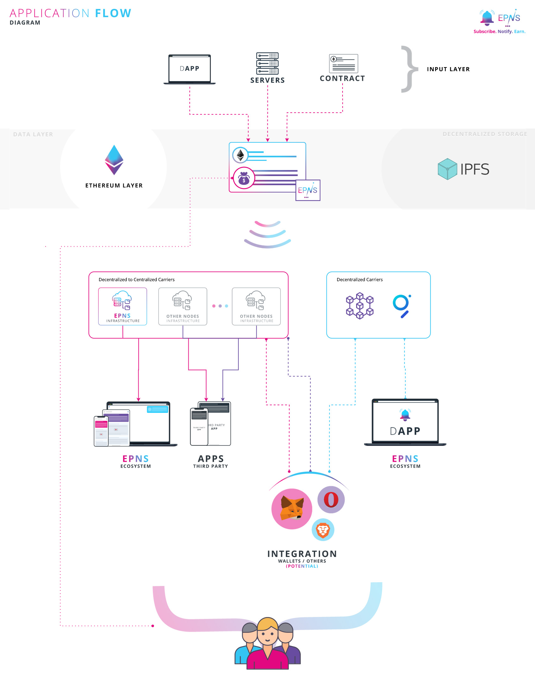

# High Level Protocol / Product Flow

EPNS uses the following flow to ensure storage, broadcasting and sending notifications in a platform agnostic and decentralized way.

Notification are stored and treated like JSON payload which is transformed as per the rules of the different carriers when the notification reaches them. JSON Payload can differ with payload types which ensures the flexibility of the content, data, storage interpretation and delivery. This helps in creating different rules and content interpretation of the notification \(for example: carrying images, call to action, live videos, etc\)

**The protocol lets user be in direct control of what services they get notification from, imposes rules on the services including spam protection for users, limiting their ability to add wallets as subscribers.**

**The protocol incentivizes users who receive notifications.**

**This on-chain abstraction of data enables delivery to centralized as well decentralized carries, notifications are treated more like a twitter feed than an ephemeral pieces of information \(though means to do so also exists\).** 

It also enables rules, incentives, settings and configuration to be retrieved from a single source of truth and is not dependent on a single point of failure.

Storing the payload JSON on decentralized storage and just the pointer / hash of it on logs of on-chain enables cost optimization, though the protocol also allows storing the entire payload on-chain for services that intend to do so.

This can be further optimized by moving parts of these mechanism to L2 layer.


Abstracting the data layer on chain \(directly or indirectly\) ensures notifications are platform agnostic. 


