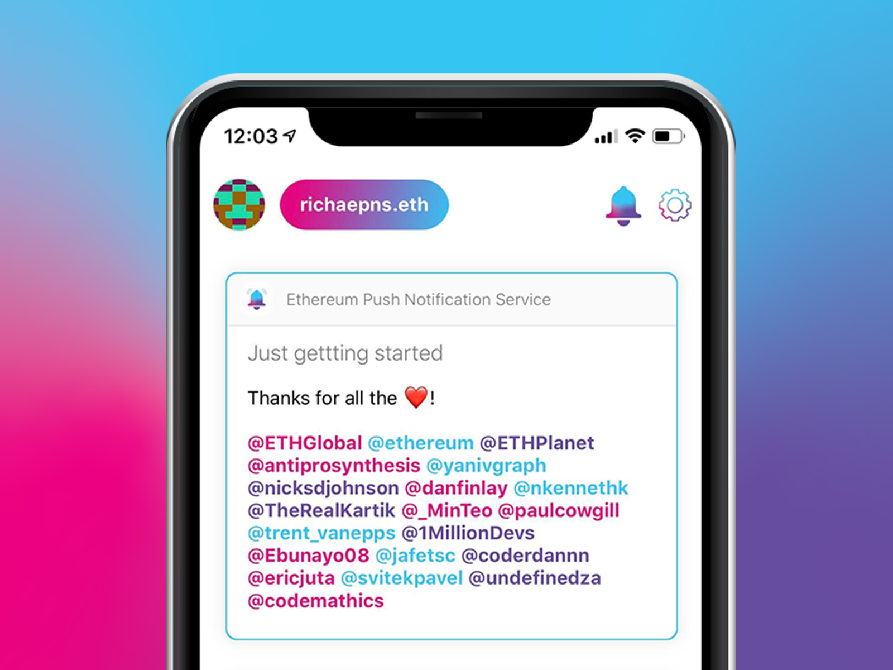

# Mobile App

The mobile app offers a seamless no user credentials sign up process. The user just needs to sign in with their wallet address and they are **all set to receive notifications**. 

## Advance user sign in \(for viewing encrypted notification\)

The encrypted notifications require users to import their private key \(or use wallet connect\). 

We created our **custom authentication flow** for this wherein the private credentials of the users never leave the device and yet they are authenticated and verified. The process is outlined below:

* The user sends their public key to the push server as a way to initiate authentication.
* Push server generates a random password, a server token id and **derives wallet from the public key**. This information is stored in the server for a temporary amount of time.
* It then stores the **server token id, wallet and plain password** and encrypts the plain password with the user public key and sends it back along with **server token id**.
* The user would need to decrypt the password which they can only do if they have access to the private key on the device.
* Once they derive the plain password, they have to then AES encrypt a static **op code** "register" along with device ids and few other details and send it back to the server with the same **server token id**.
* The server first decrypts the **op code** and if it matches then verification is successful. It then stores the **device id** and other details with the **wallet** mapping it had previously stored.

This process ensures that users private credentials never leave the device.

